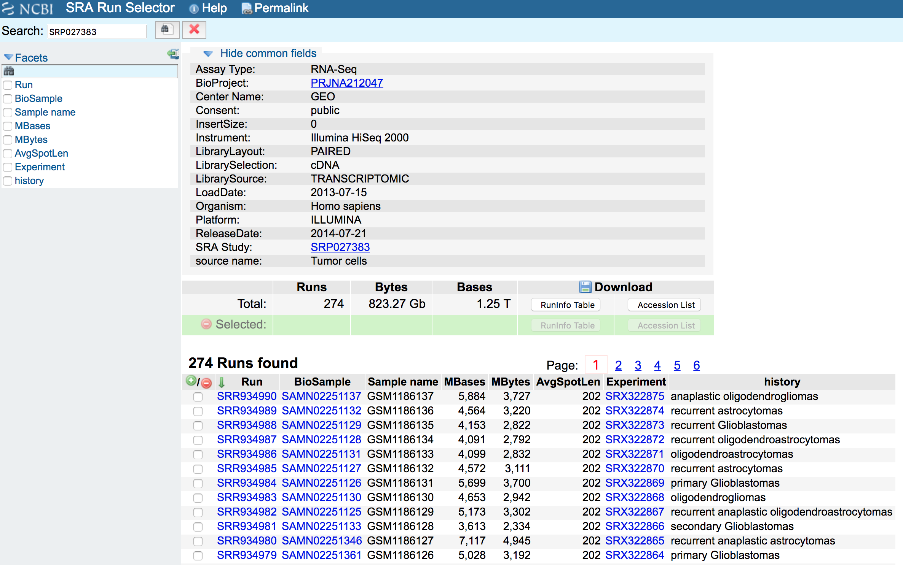

```{r 'setup', echo = FALSE, warning = FALSE, message = FALSE}
## Bib setup
library('knitcitations')
library('BiocStyle')

## Load knitcitations with a clean bibliography
cleanbib()
cite_options(hyperlink = 'to.doc', citation_format = 'text', style = 'html')

## Write bibliography information
bib <- c(
    R = citation(),
    BiocStyle = citation('BiocStyle'),
    devtools = citation('devtools'),
    knitcitations = citation('knitcitations'),
    knitr = citation('knitr')[3],
	recount = citation('recount')[1],
    recountWorkflow = citation('recount')[2],
    rmarkdown = citation('rmarkdown'),
    original = bib_metadata('10.1101/gr.165126.113'),
    jaffelab = citation('jaffelab'),
    edgeR = citation('edgeR')[1],
    edgeR2 = citation('edgeR')[2],
    limma = citation('limma'),
    voom = RefManageR::BibEntry('article', key = 'voom', author = 'CW Law and Y Chen and W Shi and GK Smyth', year = '2014', title = 'Voom: precision weights unlock linear model analysis tools for RNA-seq read counts', journal = 'Genome Biology', volume = '15', pages = 'R29'),
    clusterProfiler = citation('clusterProfiler')
)

write.bibtex(bib, file = 'example_SRP027383.bib')
```

<a href="https://jhubiostatistics.shinyapps.io/recount/"></a>

# Introduction

This document is an example of how you can use `recount_brain`. We will use the data from the SRA study [SRP027383](https://trace.ncbi.nlm.nih.gov/Traces/sra/?study=SRP027383) which is described in "RNA-seq of 272 gliomas revealed a novel, recurrent PTPRZ1-MET fusion transcript in secondary glioblastomas" `r citep(bib[['original']])`. As you can see in Figure \@ref(fig:runselector) a lot of the metadata for these samples is missing from the SRA Run Selector which makes it a great case for using `recount_brain`. We will show how to add the `recount_brain` metadata and perform a gene differential expression analysis using this information.

```{r 'runselector', fig.cap="SRA Run Selector information for study SRP027383. Screenshot from 2018-02-26.", echo=FALSE}

```

# Sample metadata

Just like any study in `recount2` `r citep(bib[['recount']])`, we first need to download the gene count data using `recount::download_study()`. Since we will be using many functions from the `recount` package, lets load it first^[If you are a first time `recount` user, we recommend first reading the package vignette at [bioconductor.org/packages/recount](http://bioconductor.org/packages/recount).].

```{r 'loadrecount', message = FALSE}
## Load the package
library('recount')
```

## Download gene data

Having loaded the package, we next download the gene-level data. 

```{r 'getgene'}
if(!file.exists(file.path('SRP027383', 'rse_gene.Rdata'))) {
    download_study('SRP027383')
} else {
    load(file.path('SRP027383', 'rse_gene.Rdata'), verbose = TRUE)
}
```

## Sample metadata included in `recount`

We can next explore the sample metadata that is included by default using `SummarizedExperiment::colData()`. These variables are explained in more detail in the supplementary material of the `recount2` paper `r citep(bib[['recount']])` and in the `recount workflow` paper `r citep(bib[['recountWorkflow']])`.

```{r 'defaultmeta'}
colData(rse_gene)
```

Note how the `characteristics` column matches the information from the SRA Run Selector in Figure \@ref(fig:runselector). Still not very useful.

```{r 'characteristics'}
colData(rse_gene)$characteristics
```

## Add `recount_brain` sample metadata

So lets add the available sample metadata from `recount_brain` using the `recount::add_metadata()` function.

```{r 'addrecountbrain'}
rse_gene <- add_metadata(rse = rse_gene, source = 'recount_brain_v1')
```

## Explore `recount_brain` metadata

We can now explore the available metadata from `recount_brain` for the SRP027383 study.

```{r 'recount_brainmeta'}
## Find which new columns have observations
new_non_NA <- sapply(22:ncol(colData(rse_gene)),
    function(i) any(!is.na(colData(rse_gene)[, i])) )
## Display the observations
colData(rse_gene)[, (22:ncol(colData(rse_gene)))[new_non_NA]]
```

Several of these variables are technical and may be duplicated with data already present, such as the SRA Experiment ids. We can still use them to verify that entries are correctly matched. Other variables might not be of huge relevance for this study such as `disease_status` since all samples in this study are from diseased tissue. However, they might be useful when working with other studies or doing meta-analyses.

```{r 'check_exp_ids'}
## Check experiment ids
identical(rse_gene$experiment, rse_gene$experiment_s)

## No healthy controls in this study
table(rse_gene$disease_status)

## All ages reported in the same unit
table(rse_gene$age_units)
```

In this study there are several variables of biological interest that we can use for different analyses. We have information about `sex`, `age`, `tumor_type`, `pathology`, `clinical_stage_1` and `clinical_stage_2`. These variables are described in more detail in the original study `r citep(bib[['original']])`. Below we explore each variable at a time, to get an idea on how diverse the data is.


```{r 'bio_vars'}
## Univariate exploration of the biological variables for SRP027383
table(rse_gene$sex)
summary(rse_gene$age)
table(rse_gene$clinical_stage_1)
table(rse_gene$tumor_type)
table(rse_gene$pathology, useNA = 'ifany')
table(rse_gene$clinical_stage_2, useNA = 'ifany')
```

We can ask some questions such as is there a difference in the mean age by sex or if the tumor grade (`clinical_stage_1`), the tumor type or the pathology is associated with sex. The answer is no for these questions so we can infer that the study design is well balanced so far.

```{r 'by_sex'}
## Age mean difference by sex? No
with(colData(rse_gene), t.test(age ~ sex))

## Tumor grade and sex association? No
with(colData(rse_gene), addmargins(table(sex, clinical_stage_1)))
with(colData(rse_gene), chisq.test(table(sex, clinical_stage_1)))

## Tumor type and sex association? No
with(colData(rse_gene), addmargins(table(sex, tumor_type)))
with(colData(rse_gene), chisq.test(table(sex, tumor_type)))

## Sex and pathology association? No
with(colData(rse_gene), addmargins(table(sex, pathology)))
with(colData(rse_gene), chisq.test(table(sex, pathology)))
```

# Gene differential expression analysis

## Gene DE setup

Now that we have sample metadata to work with we can proceed to perform a differential expression analysis at the gene level. To get started we need to load some packages.

```{r 'get_limma', message = FALSE}
## Load required packages for DE analysis
library('limma')
library('edgeR')
library('jaffelab')
## You can install it with
# devtools::install_github('LieberInstitute/jaffelab')
```

From our earlier exploration, we noticed that not all samples have pathology information, so we will drop those that are missing this information. 

```{r 'keep_patho'}
## Keep only the samples that have pathology reported
has_patho <- rse_gene[, !is.na(rse_gene$pathology)]
```

Next we will compute RPKM values and use `expression_cutoff()` from `r Githubpkg('LieberInstitute/jaffelab')` to get a suggested RPKM cutoff for dropping genes with low expression levels. Note that you can also use `r Biocpkg('genefilter')` or other packages for computing a low expression cutoff. Figure \@ref(fig:exprcut1) shows the relationship between the mean RPKM cutoff and the number of features above the given cutoff. Figure \@ref(fig:exprcut2) is the same information but in percent. Figure \@ref(fig:exprcut3) is a tad more complicated as it explore the relationship between the cutoff and the distribution of the number of non-zero samples. All three figures show estimated points where the curves bend and simply provide a guide for choosing a cutoff.


```{r 'exprcut', fig.cap = c('Number of genes expressed at given mean RPKM cutoff.', 'Percent of genes epxressed at a given mean RPKM cutoff.', 'Distribution of number of expressed samples across all genes at a given mean RPKM cutoff')}
## Compute RPKM and mean RPKM
rpkm <- getRPKM(scale_counts(has_patho))
rpkm_mean <- rowMeans(rpkm)
## Esmate a mean RPKM cutoff
expr_cuts <- expression_cutoff(rpkm)
round(mean(expr_cuts), 2)

## Filter genes with low levels of expression
has_patho <- has_patho[rpkm_mean > round(mean(expr_cuts), 2), ]
```

Having filtered the genes with low levels of expression, we can now normalize the read counts and identify genes that either have a linear trend or quadratic trend in expression levels between tumor grades II, III and IV while adjusting for age, sex and pathology. Note that this is just an example and you are welcome to try other models. We will use functions from `r Biocpkg('edgeR')` and `r Biocpkg('limma')`. 

```{r 'demodel'}
## Get read counts and normalize
dge <- DGEList(counts = assays(scale_counts(has_patho))$counts,
    genes = rowRanges(has_patho))
dge <- calcNormFactors(dge)

## Build the DE model
## See https://support.bioconductor.org/p/54707/ for details
mod <- with(colData(has_patho),
    model.matrix(~ ordered(clinical_stage_1) + sex + age + pathology))

## Terms of the DE model
colnames(mod)

## Check that the dimensions match
stopifnot(ncol(dge) == nrow(mod))

## Run voom then run limma model
gene_voom <- voom(dge, mod)
gene_fit <- eBayes(lmFit(gene_voom, mod))
```

Now that we have fitted our differential expression model we can find which genes have a linear or a quadratic change in expression along tumor grade progression. At a false discovery rate (FDR) of 1% none of the genes have a quadratic effect. 

```{r 'getstats'}
## Extract the stats for both coefficients
stats_linear <- topTable(gene_fit, coef = 2, p.value = 1,
    number = nrow(has_patho), sort.by = 'none')
stats_quad <- topTable(gene_fit, coef = 3, p.value = 1,
    number = nrow(has_patho), sort.by = 'none')

## How many genes are DE for the linear and the quadratic terms at FDR 1%?
addmargins(table('FDR 1% DE linear' = stats_linear$adj.P.Val < 0.01,
    'FDR 1% DE quadractic' = stats_quad$adj.P.Val < 0.01))
```

The fold changes are not necessarily going in the same directions for the differentially expressed genes in the linear term. From the Chi-squared test we can see that the signs are not independent. We could use this information to further explore the gene subsets.

```{r 'logFCsign'}
## Are the fold changes on the same direction?
addmargins(table(
    'logFC sign linear' = sign(stats_linear$logFC[
        stats_linear$adj.P.Val < 0.01]),
    'logFC sign quadratic' = sign(stats_quad$logFC[
        stats_linear$adj.P.Val < 0.01]))
)
chisq.test(table(
    'logFC sign linear' = sign(stats_linear$logFC[
        stats_linear$adj.P.Val < 0.01]),
    'logFC sign quadratic' = sign(stats_quad$logFC[
        stats_linear$adj.P.Val < 0.01]))
)
```


## Visualize DE genes

There are thousands of genes that have are differentially expressed in a linear progression of tumor grades. As always, it's always good to visually check some of these genes. For example, we could plot the top 100 DE genes, the 1000 to 1100 top DE genes, etc. The expression can be visualized at different points. We could visualize the raw expression counts (Figure  \@ref(fig:topgene1)), the voom-normalized expression (Figure  \@ref(fig:topgene2)) `r citep(bib[['voom']])`, or the _cleaned_ voom-normalized expression (Figure  \@ref(fig:topgene3)). The last one is the normalized expression where we regress out the effects of the adjustment covariates. This can be done using the `cleaningY()` function from `r Githubpkg('LieberInstitute/jaffelab')`. 

In the following code, we first computed the _cleaned_ normalized expression protecting the intercept term as well as the linear and quadratic trend terms. We also write a function that we can use to select which genes to plot as well as actually make the visualization with some nice features (colors, jitter points, linear trend line).


```{r 'gene_plot_code'}
## Regress out sex, age and pathology from the gene expression
cleaned_expr <- cleaningY(gene_voom$E, mod, P = 3)

## gene plotting function
plot_gene <- function(ii, type = 'cleaned', sign = 'any') {
    
    ## Order by FDR and subset by logFC sign if necessary
    if(sign == 'any') {
        fdr_sorted <- with(stats_linear, gene_id[order(adj.P.Val)])
    } else {
        fdr_sorted <- with(stats_linear[sign(stats_linear$logFC) == sign, ],
            gene_id[order(adj.P.Val)])
    }
    
    ## Get the actual gene it matches originally
    i <- match(fdr_sorted[ii], names(rowRanges(has_patho)))
    
    ## Define what type of expression we are looking at
    if(type == 'cleaned') {
        y <- cleaned_expr[i, ]
        ylab <- 'Normalized Expr: age, sex, pathology removed'
    } else if (type == 'norm') {
        y <- gene_voom$E[i, ]
        ylab <- 'Normalized Expr'
    } else if (type == 'raw') {
        y <- dge$counts[i, ]
        ylab <- 'Raw Expr'
    }
    
    ## Plot components
    x <- ordered(has_patho$clinical_stage_1)
    title <- with(stats_linear, paste(gene_id[i], symbol[i], 'FDR',
        signif(adj.P.Val[i], 3)))
    
    ## Make the plot ^^
    plot(y ~ x, xlab = 'Tumor grade', ylab = ylab, outline = FALSE,
        ylim = range(y) * c(0.95, 1.05), main = title)
    points(y ~ jitter(as.integer(x), 0.6),
        bg = c("#E69F00", "#009E73", "#D55E00")[as.integer(x)], pch = 21)
    abline(lm(y ~ as.integer(x)), lwd = 3, col = "#CC79A7")
}
```

Having built our plotting function, we can now visualize the top gene as shown in Figures \@ref(fig:topgene1), \@ref(fig:topgene2) and \@ref(fig:topgene3). In this case, there's not a large difference between the cleaned expression in Figure \@ref(fig:topgene3) and the normalized expression in Figure \@ref(fig:topgene2). From [GeneCards](http://www.genecards.org/) we can see that the [_SMC4_](http://www.genecards.org/cgi-bin/carddisp.pl?gene=SMC4) gene plays a role in the structural maintenance of chromosomes, which make sense in our context. Figure \@ref(fig:topgene4) shows the top DE gene with a decreasing expression trend across tumor grade progression. [_CCNI2_](http://www.genecards.org/cgi-bin/carddisp.pl?gene=CCNI2) is a paralog of [_CCNI_](http://www.genecards.org/cgi-bin/carddisp.pl?gene=CCNI) which has been implicated in mitosis.

```{r 'topgene', fig.cap = c('Raw expression for the top DE gene.', 'Voom-normalized expression for the top DE gene.', 'Cleaned voom-normalized expression for the top DE gene.', 'Cleaned voom-normalized expression for the top DE gene with a decreasing trend.')}
## Visualize the top gene
plot_gene(1, 'raw')
plot_gene(1, 'norm')
plot_gene(1)

## Visualize top gene with a downward trend
plot_gene(1, sign = '-1')
```

We are not experts in gliomas, but maybe your colleagues are and might recognize important genes. You can use the following code to make plots of some of the top DE genes in both directions and share the images with them to get feedback. Check the [top50_increasing](top50_increasing.pdf) and [top50_decreasing](top50_decreasing.pdf) genes in the linked PDF files.

```{r 'toppdf'}
## Plot the top 50 increasing and decreasing genes
pdf('top50_increasing.pdf')
for(i in seq_len(50)) plot_gene(i, sign = '1')
dev.off()

pdf('top50_decreasing.pdf')
for(i in seq_len(50)) plot_gene(i, sign = '-1')
dev.off()
```

## Gene ontology

Rather than look at the GeneCards for each gene, we can explore which gene ontologies are enriched in the DE genes that have a decreasing and an increasing trend with tumor grade progression. We can use `r Biocpkg('clusterProfiler')` for this exploratory task^[If you haven't done gene ontology enrichment analyses before check the vignette at [bioconductor.org/packages/clusterProfiler](http://bioconductor.org/packages/clusterProfiler).]. 

```{r 'clusterProfiler', message = FALSE}
library('clusterProfiler')
```

We need to extract the gene ids for our sets of genes of interest. Lets explore again the contents of the `stats_linear` object we created earlier. In the `gene_id` column we have the Gencode ids, which can be converted to ENSEMBL gene ids that `r Biocpkg('clusterProfiler')` can then use.

```{r 'explore_stats'}
head(stats_linear)
```

With the following code we extract all the DE genes at a FDR of 1% that have an increasing or a decreasing trend. The code comments include a way you could further subset these genes to look at say the top 200 DE genes in each direction. We will use as our _universe_ of genes all the genes that passed our low expression filter.

```{r 'gogenes'}
## Get ENSEMBL gene ids for all the DE genes with a decreasing and an
## increasing trend with tumor grade progression
de_genes <- lapply(c('-1', '1'), function(s) {
    ens <- with(stats_linear, gene_id[sign(logFC) == s & adj.P.Val < 0.01])
    ## Code if you wanted the top 200 instead
    #ens <- with(stats_linear[sign(stats_linear$logFC) == s, ],
    #    head(gene_id[order(adj.P.Val)], 200))
    ens <- gsub('\\..*', '', ens)
    return(ens)
})
names(de_genes) <- c('decreasing', 'increasing')
uni <- with(stats_linear, gsub('\\..*', '', gene_id))
```

Now that we have our `list` object with the set of genes with a decreasing or an increasing trend as well as our set of universe genes, we can compare the sets using `compareCluster()`. We will check the biological process, molecular function and cellular component ontologies. 


```{r 'gocomp', cache = TRUE}
## Which GO terms are enriched?
go_comp <- lapply(c('BP', 'MF', 'CC'), function(bp) {
    message(paste(Sys.time(), 'processing', bp))
    compareCluster(de_genes, fun = "enrichGO",
        universe = uni, OrgDb = 'org.Hs.eg.db',
        ont = bp, pAdjustMethod = "BH",
        pvalueCutoff  = 0.05, qvalueCutoff  = 0.05,
        readable= TRUE, keyType = 'ENSEMBL')
})
names(go_comp) <- c('Biological Process', 'Molecular Function',
    'Cellular Component')
```

Now that we have the data for each of the ontologies we can visualize the results using `clusterProfiler::plot()`. Figure \@ref(fig:goplot1) shows the enriched biological process terms where we see terms enriched for DNA replication and chromosome segregation in the genes with an increasing expression relationship with grade tumor progression. Intuitively this makes sense since gliomas are a type of cancer. The enriched molecular function ontology terms showin in Figure \@ref(fig:goplot2) reflect the same picture with transmembrane transporters enriched in the genes with a decreasing expression association with grade tumor progression. Figure \@ref(fig:goplot3) shows the enriched cellular components with chromosome-releated terms related with the genes that have a higher expression as tumor progression advances. This is related to the findings in the original study where they focused in gene fusions `r citep(bib[['original']])`. 

```{r 'goplot', fig.cap = c('Enriched biological process ontology terms.', 'Enriched molecular function ontology terms.', 'Enriched cellular component ontology terms.'), fig.wide = TRUE}
## Visualize enriched GO terms
xx <- lapply(names(go_comp), function(bp) {
    print(plot(go_comp[[bp]], title = paste(bp, 'ontology'), font.size = 15))
    return(NULL)
})
```

We can finally save our exploratory results in case we want to carry out more analyses with them later on. 

```{r save_res}
## Save results
save(stats_linear, stats_quad, go_comp, file = 'example_results.Rdata')
```


# Conclusions

In this document we showed how you can download expression data from `recount2` using the `r Biocpkg('recount')` package and add the sample metadata from `recount_brain`. We then illustrated how both the sample metadata and expression data can be used to explore a biological question of interest. We identified `r length(de_genes[[1]])` and `r length(de_genes[[2]])` differentially expressed genes at a FDR of 1% with decreasing and increasing linear trends in expression as tumor grade progresses while adjusting for age (in years), sex, and pathology (IDH1 mutation presence/absence).

# Reproducibility {.unnumbered}

```{r reproducibility}
## Reproducibility information
Sys.time()
proc.time()
options(width = 120)
devtools::session_info()
```


# References {.unnumbered}

The analyses were made possible thanks to:

* R `r citep(bib[['R']])`
* `r Biocpkg('BiocStyle')` `r citep(bib[['BiocStyle']])`
* `r Biocpkg('clusterProfiler')` `r citep(bib[['clusterProfiler']])`
* `r CRANpkg('devtools')` `r citep(bib[['devtools']])`
* `r Biocpkg('edgeR')` `r citep(bib[[c('edgeR', 'edgeR2')]])`
* `r Githubpkg('LieberInstitute/jaffelab')` `r citep(bib[['jaffelab']])`
* `r CRANpkg('knitcitations')` `r citep(bib[['knitcitations']])`
* `r CRANpkg('knitr')` `r citep(bib[['knitr']])`
* `r Biocpkg('limma')` `r citep(bib[[c('limma', 'voom')]])`
* `r Biocpkg('recount')` `r citep(bib[[c('recount', 'recountWorkflow')]])`
* `r CRANpkg('rmarkdown')` `r citep(bib[['rmarkdown']])`

Full [bibliography file](example_SRP027383.bib).

```{r bibliography, results='asis', echo=FALSE, warning = FALSE, message = FALSE}
## Print bibliography
bibliography()
```
